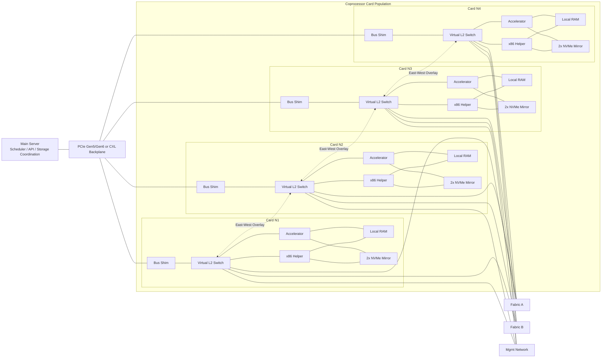

# hardwarespec

Spitballing a hardware spec for cheaper GPU clustering.

## Physical

```mermaid
flowchart TB
    subgraph CHASSIS["Main Server Chassis"]
        direction TB

        subgraph HOST["Host Server / Backplane Domain"]
            direction TB

            HOSTCPU["Host CPU Complex\nControl Plane / Scheduler / K8s Master or Worker"]
            HOSTRAM["Host DRAM"]
            HOSTBOOT["Host Boot NVMe\nOS / Logs / Orchestration"]
            PCIESW["PCIe Gen5/Gen6 Switch Fabric\nBackplane / Retimer / Slot Fanout"]

            HOSTCPU --- HOSTRAM
            HOSTCPU --- HOSTBOOT
            HOSTCPU --- PCIESW
        end

        subgraph FABRIC["Host Networking / External Fabric"]
            direction LR
            TOR1["ToR / Spine Switch A\n25/100/200/400GbE"]
            TOR2["ToR / Spine Switch B\n25/100/200/400GbE"]
            MGMT["Mgmt Network / OOB / IPMI / Provisioning"]
        end
    end

    subgraph CARD1["Card 1 - Network Appliance Coprocessor"]
        direction TB

        C1BUS["PCIe/CXL Bus Shim\nNTB / Transport / Queue Engine"]
        C1VSW["Virtual Switch / L2 Fabric\nNorthbound + Southbound Ethernet Abstraction"]
        C1CTRL["x86 Helper Complex\nLinux / Agent / Control / Pre/Post Processing"]
        C1ACC["Accelerator Complex\nNPU / GPU / Matrix / DSP"]
        C1RAM["Local DRAM / LPDDR / HBM Pool"]
        C1NICA["External Fabric Port A"]
        C1NICB["External Fabric Port B"]
        C1MGM["Mgmt Interface"]

        subgraph C1NVME["Card 1 Redundant NVMe"]
            direction LR
            C1N1["NVMe A"]
            C1N2["NVMe B"]
            C1RAID["Mirror / RAID1 / ZFS Mirror\nModel Cache / Scratch / Journaling"]
            C1N1 --- C1RAID
            C1N2 --- C1RAID
        end

        C1BUS --- C1VSW
        C1VSW --- C1CTRL
        C1VSW --- C1ACC
        C1CTRL --- C1RAM
        C1ACC --- C1RAM
        C1CTRL --- C1RAID
        C1ACC --- C1RAID
        C1VSW --- C1NICA
        C1VSW --- C1NICB
        C1VSW --- C1MGM
    end

    subgraph CARD2["Card 2 - Network Appliance Coprocessor"]
        direction TB

        C2BUS["PCIe/CXL Bus Shim\nNTB / Transport / Queue Engine"]
        C2VSW["Virtual Switch / L2 Fabric\nNorthbound + Southbound Ethernet Abstraction"]
        C2CTRL["x86 Helper Complex\nLinux / Agent / Control / Pre/Post Processing"]
        C2ACC["Accelerator Complex\nNPU / GPU / Matrix / DSP"]
        C2RAM["Local DRAM / LPDDR / HBM Pool"]
        C2NICA["External Fabric Port A"]
        C2NICB["External Fabric Port B"]
        C2MGM["Mgmt Interface"]

        subgraph C2NVME["Card 2 Redundant NVMe"]
            direction LR
            C2N1["NVMe A"]
            C2N2["NVMe B"]
            C2RAID["Mirror / RAID1 / ZFS Mirror\nModel Cache / Scratch / Journaling"]
            C2N1 --- C2RAID
            C2N2 --- C2RAID
        end

        C2BUS --- C2VSW
        C2VSW --- C2CTRL
        C2VSW --- C2ACC
        C2CTRL --- C2RAM
        C2ACC --- C2RAM
        C2CTRL --- C2RAID
        C2ACC --- C2RAID
        C2VSW --- C2NICA
        C2VSW --- C2NICB
        C2VSW --- C2MGM
    end

    subgraph CARD3["Card 3 - Network Appliance Coprocessor"]
        direction TB

        C3BUS["PCIe/CXL Bus Shim\nNTB / Transport / Queue Engine"]
        C3VSW["Virtual Switch / L2 Fabric\nNorthbound + Southbound Ethernet Abstraction"]
        C3CTRL["x86 Helper Complex\nLinux / Agent / Control / Pre/Post Processing"]
        C3ACC["Accelerator Complex\nNPU / GPU / Matrix / DSP"]
        C3RAM["Local DRAM / LPDDR / HBM Pool"]
        C3NICA["External Fabric Port A"]
        C3NICB["External Fabric Port B"]
        C3MGM["Mgmt Interface"]

        subgraph C3NVME["Card 3 Redundant NVMe"]
            direction LR
            C3N1["NVMe A"]
            C3N2["NVMe B"]
            C3RAID["Mirror / RAID1 / ZFS Mirror\nModel Cache / Scratch / Journaling"]
            C3N1 --- C3RAID
            C3N2 --- C3RAID
        end

        C3BUS --- C3VSW
        C3VSW --- C3CTRL
        C3VSW --- C3ACC
        C3CTRL --- C3RAM
        C3ACC --- C3RAM
        C3CTRL --- C3RAID
        C3ACC --- C3RAID
        C3VSW --- C3NICA
        C3VSW --- C3NICB
        C3VSW --- C3MGM
    end

    subgraph CARD4["Card 4 - Network Appliance Coprocessor"]
        direction TB

        C4BUS["PCIe/CXL Bus Shim\nNTB / Transport / Queue Engine"]
        C4VSW["Virtual Switch / L2 Fabric\nNorthbound + Southbound Ethernet Abstraction"]
        C4CTRL["x86 Helper Complex\nLinux / Agent / Control / Pre/Post Processing"]
        C4ACC["Accelerator Complex\nNPU / GPU / Matrix / DSP"]
        C4RAM["Local DRAM / LPDDR / HBM Pool"]
        C4NICA["External Fabric Port A"]
        C4NICB["External Fabric Port B"]
        C4MGM["Mgmt Interface"]

        subgraph C4NVME["Card 4 Redundant NVMe"]
            direction LR
            C4N1["NVMe A"]
            C4N2["NVMe B"]
            C4RAID["Mirror / RAID1 / ZFS Mirror\nModel Cache / Scratch / Journaling"]
            C4N1 --- C4RAID
            C4N2 --- C4RAID
        end

        C4BUS --- C4VSW
        C4VSW --- C4CTRL
        C4VSW --- C4ACC
        C4CTRL --- C4RAM
        C4ACC --- C4RAM
        C4CTRL --- C4RAID
        C4ACC --- C4RAID
        C4VSW --- C4NICA
        C4VSW --- C4NICB
        C4VSW --- C4MGM
    end

    PCIESW --- C1BUS
    PCIESW --- C2BUS
    PCIESW --- C3BUS
    PCIESW --- C4BUS

    C1NICA --- TOR1
    C1NICB --- TOR2
    C2NICA --- TOR1
    C2NICB --- TOR2
    C3NICA --- TOR1
    C3NICB --- TOR2
    C4NICA --- TOR1
    C4NICB --- TOR2

    C1MGM --- MGMT
    C2MGM --- MGMT
    C3MGM --- MGMT
    C4MGM --- MGMT

    C1VSW <-. "L2 Overlay / VXLAN / Service Mesh" .-> C2VSW
    C2VSW <-. "L2 Overlay / VXLAN / Service Mesh" .-> C3VSW
    C3VSW <-. "L2 Overlay / VXLAN / Service Mesh" .-> C4VSW
    C1VSW <-. "Optional Full Mesh" .-> C3VSW
    C2VSW <-. "Optional Full Mesh" .-> C4VSW
```

## Logical

## Ops

Each card has redundant NVMe for local model cache, journaling, scratch, and survival of a single SSD failure.

The bus is not exposed as the application contract. It is just transport.

The network contract is Ethernet northbound and southbound.

Each card behaves like a micro-node with:
- local compute
- local RAM
- local mirrored storage
- a virtual switch or NIC plane

Dual uplinks to Fabric A / Fabric B give path redundancy.

## Operating model

- host server handles orchestration, inventory, placement, health
- cards boot independently or semi-independently
- each card joins the cluster as an Ethernet node

Local mirrored NVMe stores:
- model shards
- inference cache
- local logs
- replay/simulation data
- temporary checkpoint fragments
